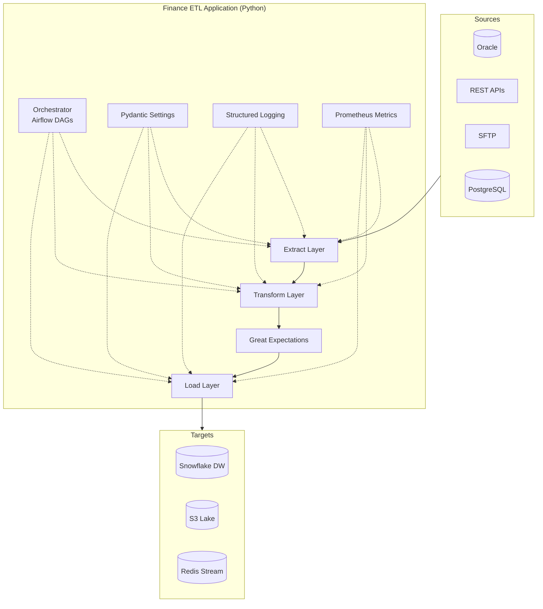

# Finance ETL Architecture

## High-Level Design

Finance ETL is a layered ETL pipeline built on the Kimball dimensional modeling approach, with clear separation between **Extract**, **Transform**, **Load** and supporting concerns (orchestration, observability, quality).

## Layered Architecture

## Data Flow

1. **Extraction** uses connector-specific classes (each in `src/finance_etl/extract/`) that yield Pydantic-validated records.
2. **Transformation** chains pure-ish functions across modules in `src/finance_etl/transform/`:
   - `CurrencyNormalizer` — converts amounts to USD using daily FX
   - `FraudScoringEngine` — rule-based scoring with state per customer
   - `SOXValidator` — compliance gating
   - `RFMSegmenter` — customer segmentation
   - `DataQualityScorer` — per-record DQ scoring
3. **Quality gates** run Great Expectations suites between transform and load.
4. **Loading** writes to multiple targets in parallel via `src/finance_etl/load/`:
   - Snowflake (star schema; SCD Type 2 for `dim_customer`)
   - S3 (Hive-partitioned Parquet)
   - Redis (Streams for fraud alerts; List for DLQ)

## Cross-Cutting Concerns

| Concern | Implementation |
|---------|---------------|
| **Configuration** | Pydantic `BaseSettings` with `.env` |
| **Logging** | `structlog` JSON output, with `contextvars` for trace IDs |
| **Metrics** | `prometheus_client` over HTTP on port 8000 |
| **Retries** | `tenacity` decorator with exponential backoff |
| **Idempotency** | SHA-256 checksums for SFTP, watermarks for DB, MERGE for Snowflake |
| **DLQ** | Redis list for records failing GE suite |

## Operational SLAs

| Metric | Target |
|--------|--------|
| Pipeline latency (daily run) | < 30 min |
| Data freshness (Snowflake) | < 4 hr |
| Fraud alert latency (Redis) | < 5 min |
| DQ pass rate | > 99% |
| Pipeline success rate | > 99.5% / 30 days |
